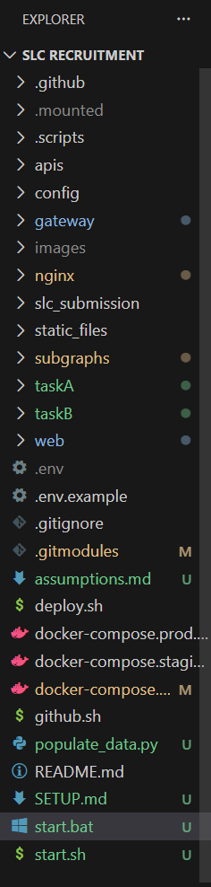
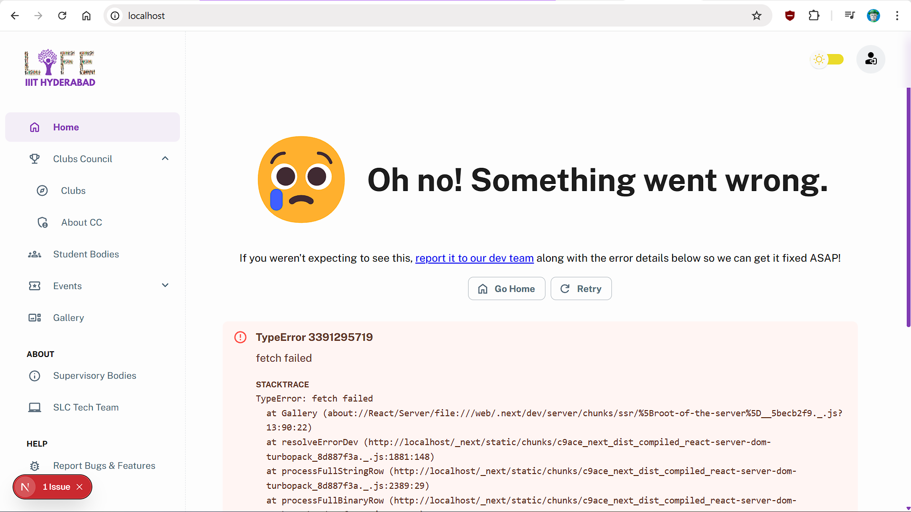
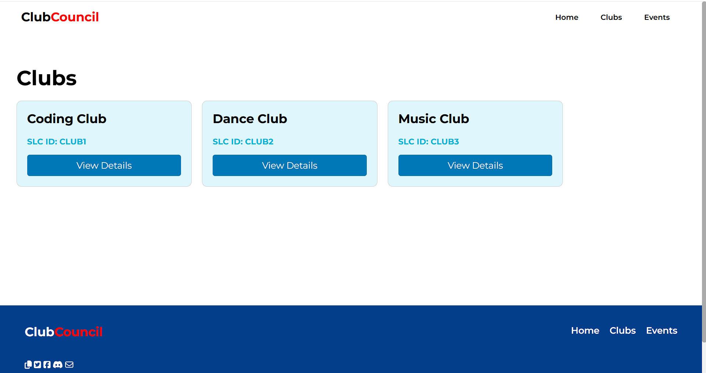
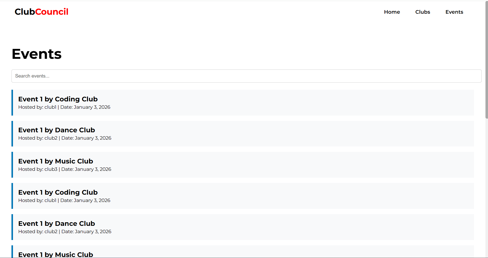
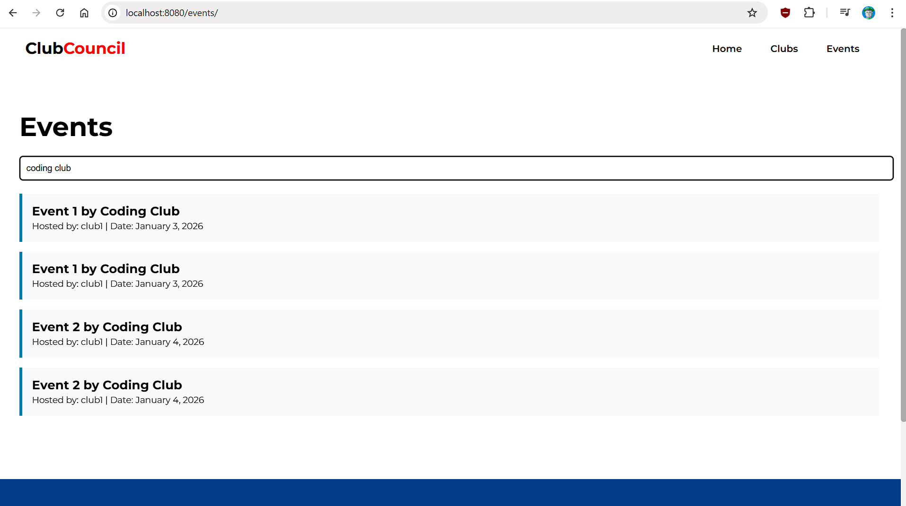

# SLC Recruitment - Quick Setup Guide

## Prerequisites
- Docker Desktop installed and running
- Python 3.x with `requests` library (`pip install requests`)

## Quick Start (Windows)

1. **Start all services:**
   ```powershell
   # From the project root directory
   .\start.bat
   ```
   Or manually:
   ```powershell
   docker compose up -d
   cd taskB
   docker compose up -d
   ```

2. **Populate data:**
   ```powershell
   cd taskA
   python populate_data.py
   ```

3. **WordPress First-Time Setup** (localhost:8080):
   - Complete WordPress installation wizard
   - Go to **Appearance > Themes** → Activate "ShoeStop"
   - Go to **Plugins** → Activate "SLC Connector"  
   - Go to **Settings > Permalinks** → Select "Post name" → Save
   - Create two pages:
     - Page "Clubs" with content: `[slc_clubs]`
     - Page "Events" with content: `[slc_events]`

## Services

| Service | URL | Description |
|---------|-----|-------------|
| Task A Frontend | http://localhost | React frontend for club management |
| GraphQL API | http://localhost/graphql | GraphQL endpoint |
| WordPress | http://localhost:8080 | WordPress site with club/event display |

## Troubleshooting

### WordPress shows "No clubs found"
The WordPress container must be on the same Docker network as the gateway. This should be automatic with the updated docker-compose, but if needed:
```powershell
docker network connect slcrecruitment_default slc-wp
```

### Events not appearing
Events need to be in "approved" state. The `populate_data.py` script handles this automatically by calling the `progressEvent` mutation after creation.

### After Docker restart
1. Start Task A first: `docker compose up -d`
2. Wait 10 seconds
3. Start WordPress: `cd taskB && docker compose up -d`

The slcrecruitment_default network must exist before WordPress can connect to it.

## Architecture

```
┌─────────────────────────────────────────────────────────────────┐
│                        Docker Network                           │
│                   (slcrecruitment_default)                      │
│                                                                 │
│  ┌──────────┐     ┌─────────┐     ┌──────────────────────────┐ │
│  │ WordPress│────▶│  Nginx  │────▶│    GraphQL Gateway       │ │
│  │ :8080    │     │  :80    │     │    (Apollo Federation)   │ │
│  └──────────┘     └─────────┘     └──────────────────────────┘ │
│                                              │                  │
│                    ┌─────────────────────────┼─────────────────┐│
│                    ▼              ▼          ▼         ▼       ││
│              ┌─────────┐  ┌─────────┐ ┌─────────┐ ┌─────────┐  ││
│              │ Clubs   │  │ Members │ │ Events  │ │  Users  │  ││
│              │Subgraph │  │Subgraph │ │Subgraph │ │Subgraph │  ││
│              └─────────┘  └─────────┘ └─────────┘ └─────────┘  ││
│                    │              │          │         │       ││
│                    └──────────────┴──────────┴─────────┘       ││
│                                   │                            ││
│                             ┌──────────┐                       ││
│                             │ MongoDB  │                       ││
│                             └──────────┘                       ││
└─────────────────────────────────────────────────────────────────┘
```

## Files Modified for Auth Bypass

The following files have mock user injection to bypass authentication:
- `subgraphs/clubs/mutations.py` - createClub
- `subgraphs/members/mutations.py` - createMember  
- `subgraphs/events/mutations/events.py` - createEvent, progressEvent

**WARNING:** These bypasses are for development only. Remove before production use.

---

## Screenshots

### Project Structure


### Task A - Local Docker Setup

#### Localhost Running


#### All Clubs View


#### Club Details


#### All Events View


### Task B - WordPress Integration

#### Clubs Page (WordPress)


#### Events Page (WordPress)


#### Events Page with Search (WordPress)

